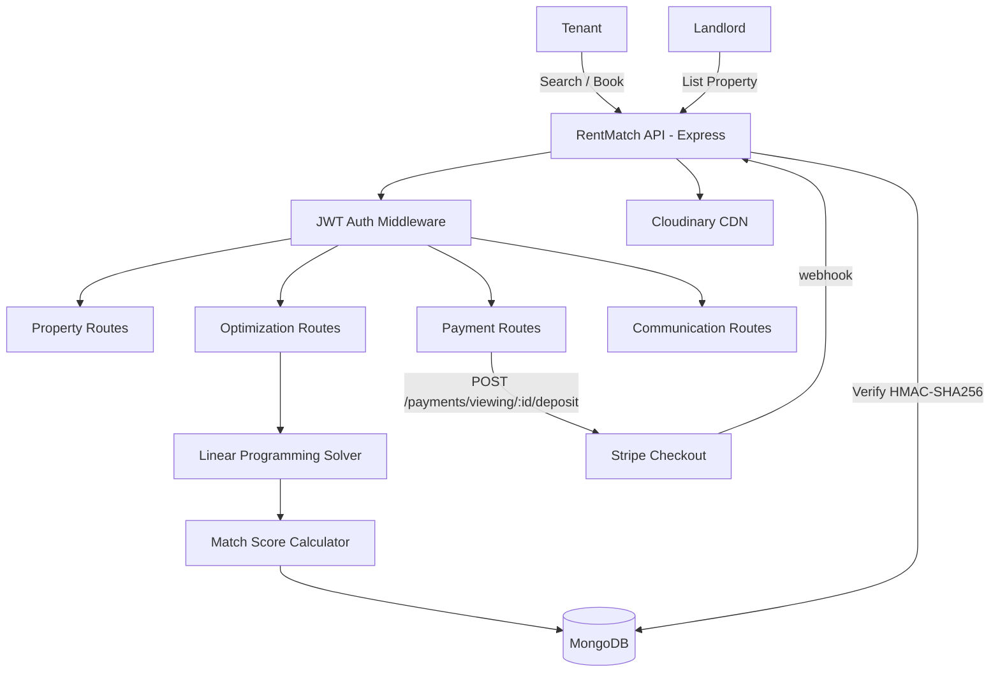
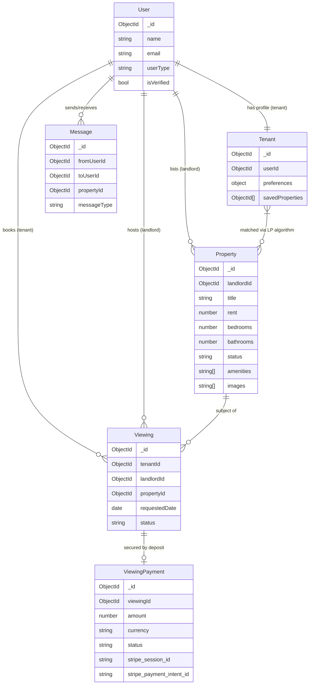
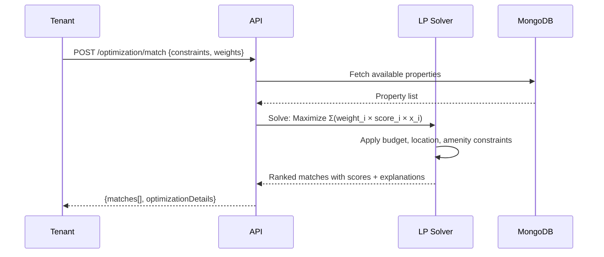
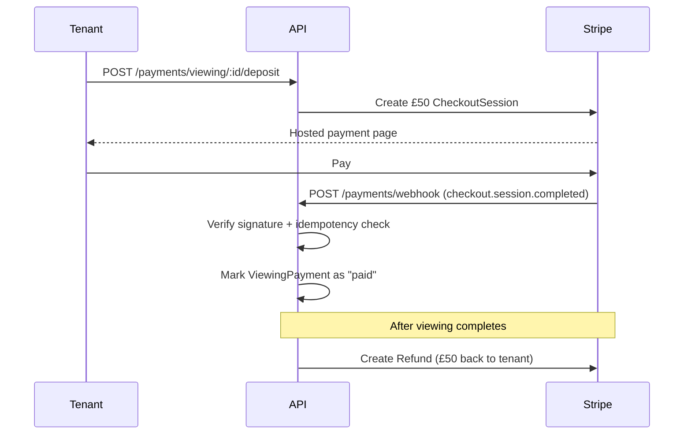

# RentMatch Backend - Linear Programming Optimization API

A Node.js/Express backend API for tenant-property matching using Linear Programming optimization algorithms.

## 🎯 Project Overview

This backend system implements a **Linear Programming approach** to optimize tenant-property matching based on multiple constraints and weighted preferences. The system is designed for a final year project focusing on mathematical optimization in real estate.

## 🧮 Linear Programming Implementation

### Mathematical Model

The optimization problem is formulated as:

**Objective Function:**
\`\`\`
Maximize: Σ(wi × xi × si) for all properties i
\`\`\`

**Subject to constraints:**
- Budget constraint: `rent_i ≤ budget_max`
- Location constraint: `location_i ∈ preferred_locations`
- Amenity constraints: `required_amenities ⊆ property_amenities_i`
- Size constraints: `bedrooms_i = required_bedrooms`

Where:
- `wi` = weight for criterion type
- `xi` = binary decision variable (1 if property selected, 0 otherwise)
- `si` = normalized score for property i on criterion

## 🚀 Features

- **Linear Programming Optimization Engine**
- RESTful API with Express.js
- MongoDB database with Mongoose ODM
- JWT Authentication & Authorization
- Input validation and sanitization
- Rate limiting and security middleware
- Comprehensive logging system
- TypeScript for type safety

## 📁 Project Structure

\`\`\`
project-backend/
├── src/
│   ├── config/
│   │   └── database.ts
│   ├── controllers/
│   │   ├── authController.ts
│   │   ├── propertyController.ts
│   │   └── optimizationController.ts
│   ├── middleware/
│   │   ├── auth.ts
│   │   └── rateLimiter.ts
│   ├── models/
│   │   ├── User.ts
│   │   ├── Tenant.ts
│   │   └── Property.ts
│   ├── routes/
│   │   ├── auth.ts
│   │   ├── properties.ts
│   │   └── optimization.ts
│   ├── services/
│   │   └── LinearProgrammingService.ts
│   ├── scripts/
│   │   └── seedDatabase.ts
│   ├── types/
│   │   └── index.ts
│   ├── utils/
│   │   └── logger.ts
│   └── server.ts
├── package.json
├── tsconfig.json
├── .env.example
└── README.md
\`\`\`

## 🛠️ Installation & Setup

1. **Clone the repository**
\`\`\`bash
git clone <repository-url>
cd project-backend
\`\`\`

2. **Install dependencies**
\`\`\`bash
npm install
\`\`\`

3. **Environment Setup**
\`\`\`bash
cp .env.example .env
# Edit .env with your configuration
\`\`\`

4. **Start MongoDB**
\`\`\`bash
# Make sure MongoDB is running on your system
mongod
\`\`\`

5. **Seed the database**
\`\`\`bash
npm run seed
\`\`\`

6. **Start the development server**
\`\`\`bash
npm run dev
\`\`\`

## 🔧 Environment Variables

\`\`\`env
NODE_ENV=development
PORT=3001
MONGODB_URI=mongodb://localhost:27017/rentmatch
JWT_SECRET=your-secret-key
LP_DEFAULT_WEIGHTS_BUDGET=0.3
LP_DEFAULT_WEIGHTS_LOCATION=0.25
LP_DEFAULT_WEIGHTS_AMENITIES=0.25
LP_DEFAULT_WEIGHTS_SIZE=0.2
\`\`\`

## 📚 API Endpoints

### Authentication
- `POST /api/v1/auth/register` - Register new user
- `POST /api/v1/auth/login` - User login
- `GET /api/v1/auth/profile` - Get user profile

### Properties
- `GET /api/v1/properties` - Get all properties (with filters)
- `GET /api/v1/properties/:id` - Get property by ID
- `POST /api/v1/properties` - Create property (landlords only)
- `PUT /api/v1/properties/:id` - Update property
- `DELETE /api/v1/properties/:id` - Delete property

### Linear Programming Optimization
- `POST /api/v1/optimization/linear-programming` - Run optimization
- `GET /api/v1/optimization/matches/:tenantId` - Get matches for tenant
- `GET /api/v1/optimization/stats` - Get optimization statistics

## 🧪 Testing the Linear Programming Algorithm

### Sample Optimization Request

\`\`\`bash
curl -X POST http://localhost:3001/api/v1/optimization/linear-programming \
  -H "Content-Type: application/json" \
  -H "Authorization: Bearer YOUR_JWT_TOKEN" \
  -d '{
    "constraints": {
      "budget": { "min": 400000, "max": 1000000 },
      "location": "Lagos",
      "amenities": ["WiFi", "Security", "Parking"],
      "bedrooms": 2,
      "bathrooms": 1
    },
    "weights": {
      "budget": 0.4,
      "location": 0.3,
      "amenities": 0.2,
      "size": 0.1
    },
    "maxResults": 5
  }'
\`\`\`

### Sample Response

\`\`\`json
{
  "success": true,
  "message": "Linear Programming optimization completed successfully",
  "data": {
    "matches": [
      {
        "propertyId": "...",
        "matchScore": 87,
        "matchDetails": {
          "budgetScore": 85,
          "locationScore": 90,
          "amenityScore": 80,
          "sizeScore": 95
        },
        "explanation": [
          "Excellent budget fit: ₦850,000",
          "Perfect location in Victoria Island",
          "Most required amenities available"
        ],
        "property": { /* property details */ }
      }
    ],
    "statistics": {
      "executionTime": 1200,
      "constraintsSatisfied": 4,
      "totalConstraints": 4,
      "objectiveValue": 0.87,
      "algorithm": "Linear Programming"
    }
  }
}
\`\`\`

## 🔍 Linear Programming Algorithm Details

The `LinearProgrammingService` implements:

1. **Constraint Filtering**: Hard constraints eliminate infeasible properties
2. **Score Calculation**: Each property gets normalized scores (0-100) for each criterion
3. **Weighted Optimization**: Linear combination using user-defined weights
4. **Solution Selection**: Properties with highest objective function values

### Scoring Functions

- **Budget Score**: Higher scores for better value (closer to minimum budget)
- **Location Score**: Exact matches get 100, partial matches get proportional scores
- **Amenity Score**: Percentage of required amenities available
- **Size Score**: Bedroom/bathroom match with bonus for extras

## 📊 Performance Metrics

The system tracks:
- Execution time per optimization
- Constraint satisfaction rates
- Average match scores
- Algorithm efficiency metrics

## 🔒 Security Features

- JWT-based authentication
- Rate limiting on sensitive endpoints
- Input validation and sanitization
- CORS protection
- Helmet security headers

## 🚀 Deployment

1. **Build the project**
\`\`\`bash
npm run build
\`\`\`

2. **Start production server**
\`\`\`bash
npm start
\`\`\`

## 📝 Development Scripts

- `npm run dev` - Start development server with hot reload
- `npm run build` - Build TypeScript to JavaScript
- `npm run start` - Start production server
- `npm run seed` - Seed database with sample data
- `npm run lint` - Run ESLint
- `npm test` - Run tests

## 🤝 Contributing

This is a final year project. For academic purposes only.

## 📄 License

MIT License - Academic Project

---

**Note**: This backend is specifically designed for a final year project focusing on Linear Programming optimization in property matching. The mathematical model and implementation demonstrate practical application of optimization algorithms in real estate technology.

---

## Payment Integration

RentMatch includes a Stripe-powered viewing deposit system to reduce no-shows and protect landlords' time.

### Flow

```
Tenant requests viewing → Landlord confirms → Tenant pays £50 deposit
       │
       ▼
  Stripe Checkout Session
       │
       ▼
  stripe-signature webhook → deposit marked "paid" in DB
       │
  ┌────┴────────────────────┐
  │ Viewing completed?       │
  ├──── Yes ──────────────▶ Stripe Refund issued (tenant gets £50 back)
  └──── No-show ──────────▶ Deposit forfeited (landlord compensated)
```

### Security
- Webhook signature verified with HMAC-SHA256 (`stripe.webhooks.constructEvent`)
- Raw body preserved before `express.json()` middleware
- Idempotency: duplicate webhook deliveries are a no-op (session ID checked)
- 30-minute Checkout Session expiry to prevent stale links
- Replay protection via Stripe's built-in timestamp tolerance

### Payment Endpoints

| Method | Endpoint | Auth | Description |
|--------|----------|------|-------------|
| POST | `/api/v1/payments/viewing/:id/deposit` | tenant | Create Stripe Checkout Session for deposit |
| GET | `/api/v1/payments/viewing/:id/deposit` | tenant/landlord | Get deposit payment status |
| POST | `/api/v1/payments/webhook` | — | Stripe webhook receiver |

### Environment Variables (Stripe)

```env
STRIPE_SECRET_KEY=sk_test_...
STRIPE_WEBHOOK_SECRET=whsec_...
APP_URL=https://your-frontend.vercel.app
BASE_URL=https://your-api.onrender.com
```

---

## Architecture



## Data Model — ERD



## Optimization Flow



## Viewing Deposit Flow



