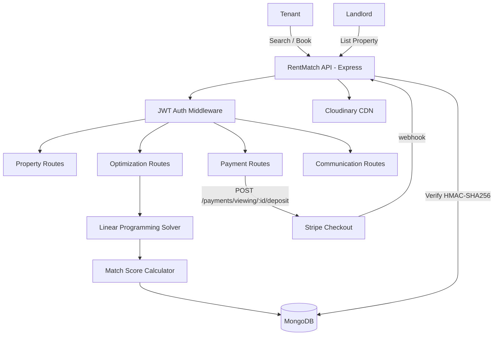
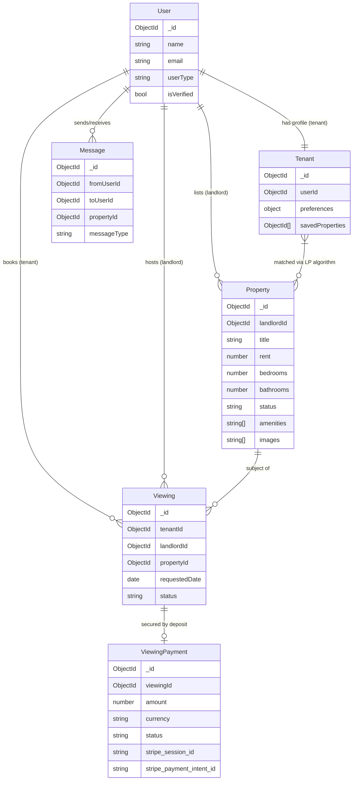
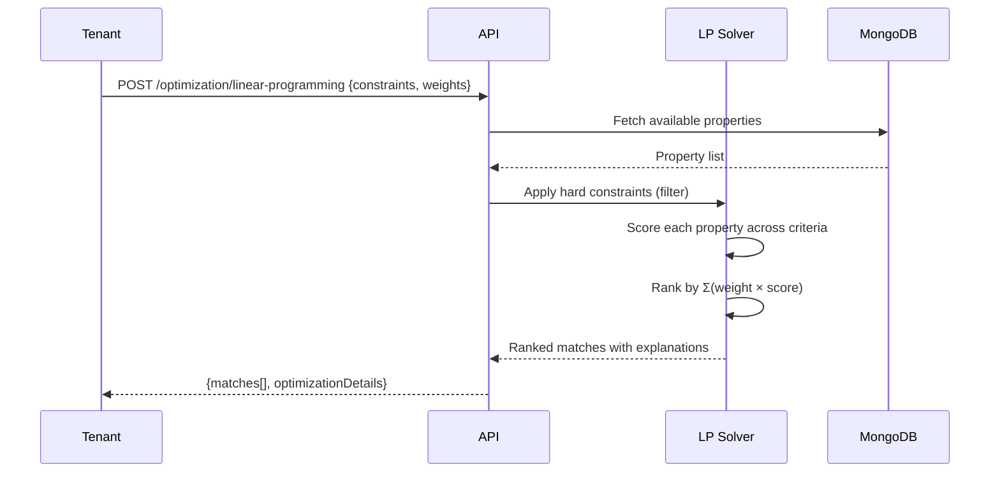
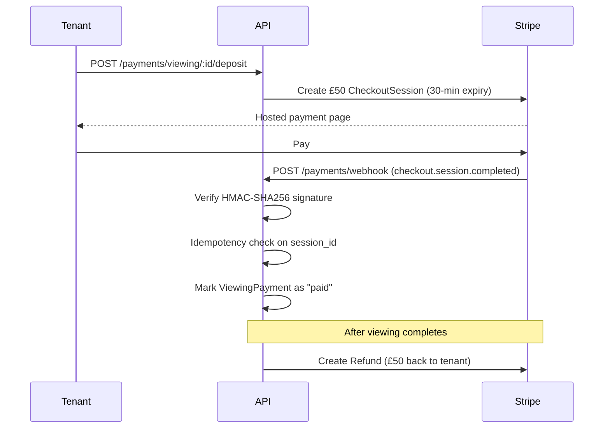

# RentMatch API

A property-matching platform that uses Linear Programming optimization to match tenants with properties based on budget, location, amenities, and size preferences. Includes a Stripe-powered viewing deposit system to reduce no-shows and protect landlord time.

## Table of Contents

- [Architecture](#architecture)
- [Features](#features)
- [Tech Stack](#tech-stack)
- [API Reference](#api-reference)
- [Getting Started](#getting-started)
- [Environment Variables](#environment-variables)
- [Data Model](#data-model)
- [Optimization Algorithm](#optimization-algorithm)
- [Payment Flow](#payment-flow)

---

## Architecture



---

## Features

### Property Matching

- Linear Programming optimization engine that ranks properties by weighted score across budget, location, amenities, and size constraints
- Hard-constraint filtering eliminates infeasible properties before scoring
- Configurable weights per search (e.g. prioritize budget over location)
- Match explanations returned with every result

### Viewing Deposit System

- Tenants pay a £50 refundable deposit to confirm a viewing
- Stripe Checkout Session created per viewing — expires in 30 minutes
- Webhook signature verified with HMAC-SHA256 before any DB write
- Idempotent: duplicate `checkout.session.completed` events are a no-op
- Deposit refunded automatically when viewing completes; forfeited on no-show

### Auth and Access Control

- JWT-based auth with role separation: tenant, landlord, admin
- Rate limiting on auth endpoints
- Input validation and sanitization via express-validator
- Helmet security headers

---

## Tech Stack

| Layer | Technology |
|-------|-----------|
| Runtime | Node.js + TypeScript |
| Framework | Express.js |
| Database | MongoDB + Mongoose |
| Payments | Stripe Checkout (viewing deposits) |
| Auth | JWT, bcrypt |
| File Uploads | Cloudinary |
| Validation | express-validator |
| Logging | Winston |

---

## API Reference

### Auth — `/api/v1/auth`

| Method | Endpoint | Description |
|--------|----------|-------------|
| POST | `/register` | Register as tenant or landlord |
| POST | `/login` | Authenticate and receive JWT |
| GET | `/profile` | Get current user profile |

### Properties — `/api/v1/properties`

| Method | Endpoint | Auth | Description |
|--------|----------|------|-------------|
| GET | `/` | — | List properties with filters |
| GET | `/:id` | — | Get property by ID |
| POST | `/` | landlord | Create property listing |
| PUT | `/:id` | landlord | Update property |
| DELETE | `/:id` | landlord | Delete property |

### Optimization — `/api/v1/optimization`

| Method | Endpoint | Auth | Description |
|--------|----------|------|-------------|
| POST | `/linear-programming` | tenant | Run LP optimization with constraints and weights |
| GET | `/matches/:tenantId` | tenant | Get saved matches for tenant |
| GET | `/stats` | admin | Optimization statistics |

### Payments — `/api/v1/payments`

| Method | Endpoint | Auth | Description |
|--------|----------|------|-------------|
| POST | `/viewing/:id/deposit` | tenant | Create £50 Stripe Checkout Session |
| GET | `/viewing/:id/deposit` | tenant/landlord | Get deposit payment status |
| POST | `/webhook` | — | Stripe webhook receiver (signature-verified) |

---

## Getting Started

### Prerequisites

- Node.js 18+
- MongoDB
- Stripe account

### Setup

```bash
git clone https://github.com/Olayanju-1234/rentmatch-api.git
cd rentmatch-api
npm install
cp .env.example .env   # fill in all values
npm run seed           # seed sample property data
npm run dev
```

---

## Environment Variables

```env
NODE_ENV=development
PORT=3001
MONGODB_URI=mongodb://localhost:27017/rentmatch

# JWT
JWT_SECRET=your_jwt_secret

# Stripe
STRIPE_SECRET_KEY=sk_test_...
STRIPE_WEBHOOK_SECRET=whsec_...

# Cloudinary
CLOUDINARY_CLOUD_NAME=your_cloud_name
CLOUDINARY_API_KEY=your_api_key
CLOUDINARY_API_SECRET=your_api_secret

# App URLs
APP_URL=http://localhost:3000
BASE_URL=http://localhost:3001

# LP defaults
LP_DEFAULT_WEIGHTS_BUDGET=0.3
LP_DEFAULT_WEIGHTS_LOCATION=0.25
LP_DEFAULT_WEIGHTS_AMENITIES=0.25
LP_DEFAULT_WEIGHTS_SIZE=0.2
```

---

## Data Model



---

## Optimization Algorithm

The `LinearProgrammingService` implements a weighted scoring model:

**Objective:** Maximize `Σ(weight_i × score_i × x_i)` for all candidate properties

**Constraints applied (hard filters):**
- `rent ≤ budget_max`
- `location ∈ preferred_locations`
- `required_amenities ⊆ property_amenities`
- `bedrooms = required_bedrooms`

**Scoring functions:**
- Budget: higher score for better value (lower rent relative to max budget)
- Location: 100 for exact match, proportional for partial
- Amenities: percentage of required amenities present
- Size: bedroom/bathroom match with bonus for extras



---

## Payment Flow



---

## Sample Optimization Request

```bash
curl -X POST http://localhost:3001/api/v1/optimization/linear-programming \
  -H "Content-Type: application/json" \
  -H "Authorization: Bearer $TOKEN" \
  -d '{
    "constraints": {
      "budget": { "max": 1000000 },
      "location": "Lagos",
      "amenities": ["WiFi", "Security", "Parking"],
      "bedrooms": 2
    },
    "weights": {
      "budget": 0.4,
      "location": 0.3,
      "amenities": 0.2,
      "size": 0.1
    },
    "maxResults": 5
  }'
```
